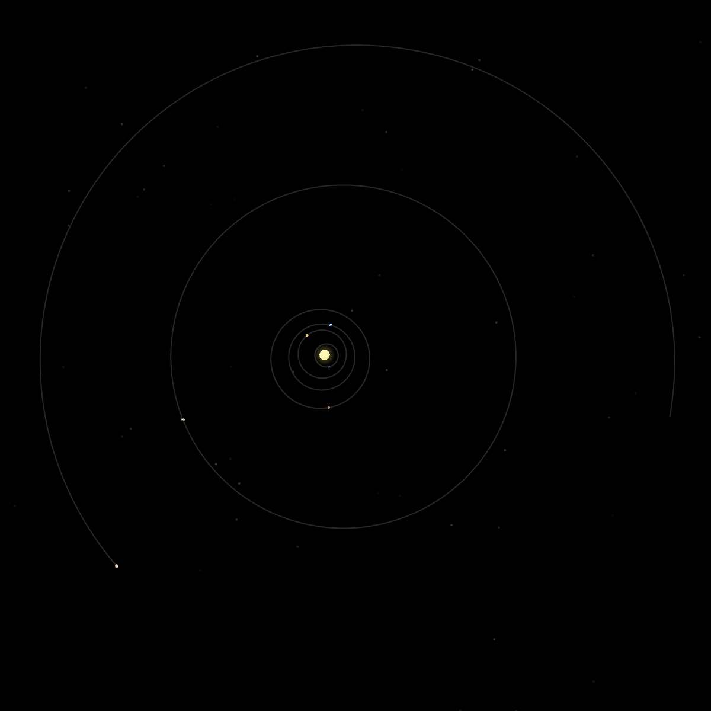
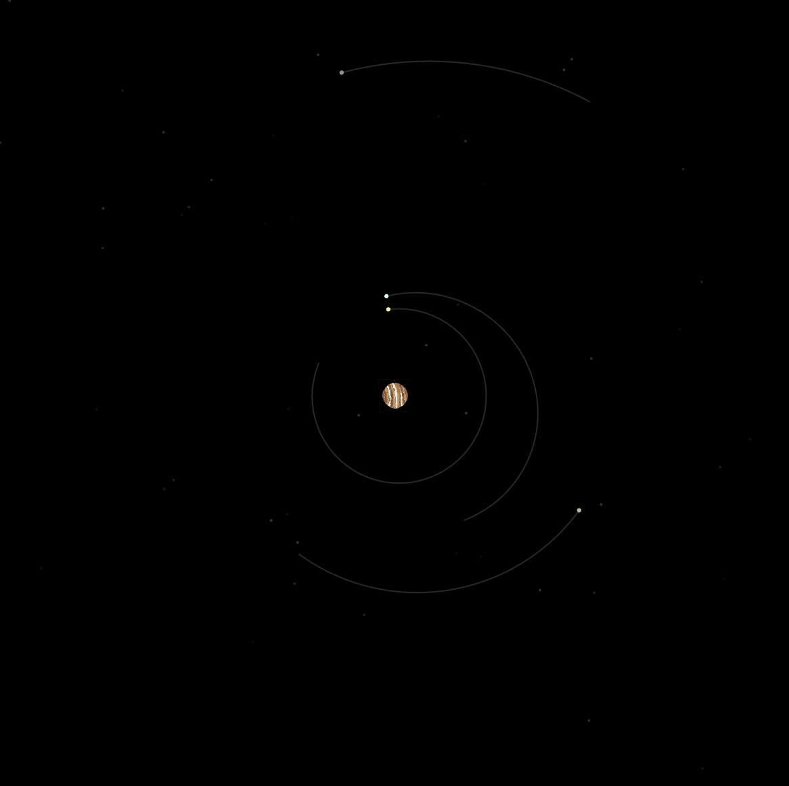
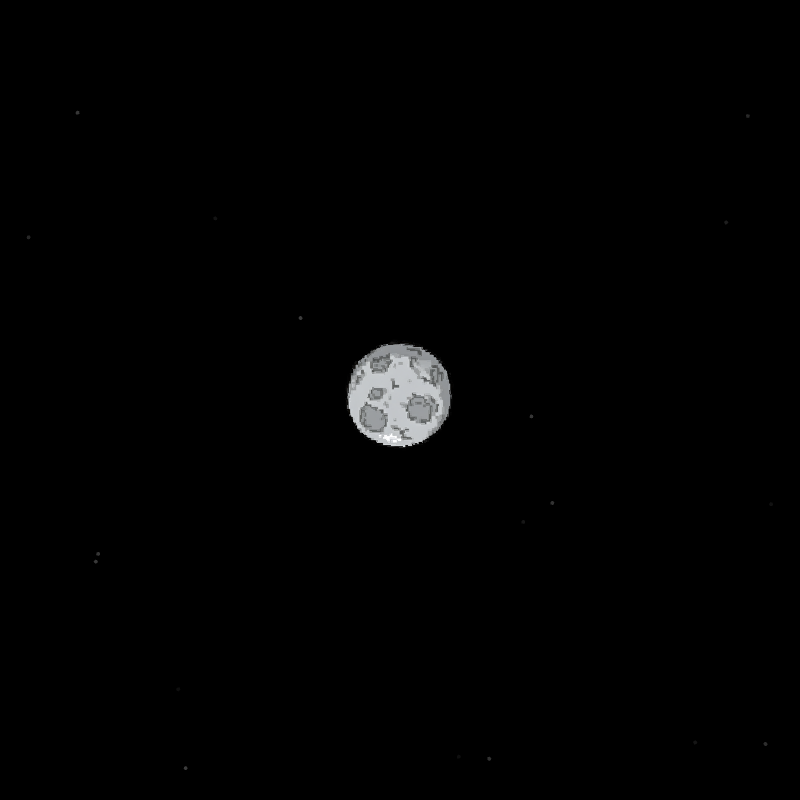

#  SolarSim

In SolarSim, explore our solar system and many of the planets' major moons; all simulated using Netownian physics!

## Features


<table>
    <tr style="border-width: 0">
        <td width="25%" style="border-width: 0">
             
        </td>
        <td width="75%" style="border-width: 0">
            <h3>System View:</h3>
            <ul>
                <li>When loading the webapp, you begin by viewing a zoomed out view of the entire solar system. From here you can see the orbits of all the planets within our solar system with their orbital distances to scale.</li>
                <li>Various statistics and details about the sun and our solar system are displayed to the right.</li>
            </ul>
        </td>
    </tr>
</table>
<table>
    <tr>
        <td width="75%" style="border-width: 0">
            <h3>Planet Zoomed View:</h3>
            <ul>
                <li>Selecting a planet, either by clicking it directly or using the list on the right, will zoom further into its orbit showing its major moons as well.</li>
                <li>Various statistics and details about the selected plant and its orbit are dsiplayed to the right.</li>
            </ul>
        </td>
        <td width="25%" style="border-width: 0">
             
        </td>
    </tr>
</table>
<table>
    <tr style="border-width: 0">
        <td width="25%" style="border-width: 0">
             
        </td>
        <td width="75%" style="border-width: 0">
            <h3>Moon Zoomed View:</h3>
            <ul>
                <li>Within the planet view, you can further select and zoom into major moons.</li>
                <li>Various statistics and details about the selected moon and its orbit are displayed to the right.</li>
            </ul>
        </td>
    </tr>
</table>

## Installation

### Dependecies
* [Apache](https://httpd.apache.org/) (Webserver)

### Clone the repository
```bash
git clone https://github.com/wcouture/PlanetaryBodies.git
```

### Configure Apache 
Modify the <i>httpd.conf</i> apache configuration file to set the root directory to the cloned respository. ("{<i>PATH_TO_CLONED_REPOSITORY</i>}/PlanetaryBodies/")<br>

<i>If installed through a package manager, httpd.conf will likely be in one of the following locations:</i>
* /etc/apache2/httpd.conf
* /etc/apache2/apache2.conf
* /etc/httpd/httpd.conf
* /etc/httpd/conf/httpd.conf

Additionally configure your domain name within httpd.conf and SSL certificates within ssl.conf, located within the conf.d directory within the httpd or apache2 directory, if desired.

### Start Apache Server
<i>The following commands demonstrate how to start, stop, and restart the webserver on a linux distribution.</i><br>

Start:
```bash
sudo systemctl start httpd
```
Stop:
```bash
sudo systemctl stop httpd
```
Restart:
```bash
sudo systemctl restart httpd
```

## Usage
Navigate to http(s)://localhost or http(s)://{YOUR_DOMAIN} if a domain is configured to access the webapp.
## Contributing

Pull requests are welcome. For major changes, please open an issue first
to discuss what you would like to change.

Please make sure to update tests as appropriate.

## License

[MIT](https://choosealicense.com/licenses/mit/)